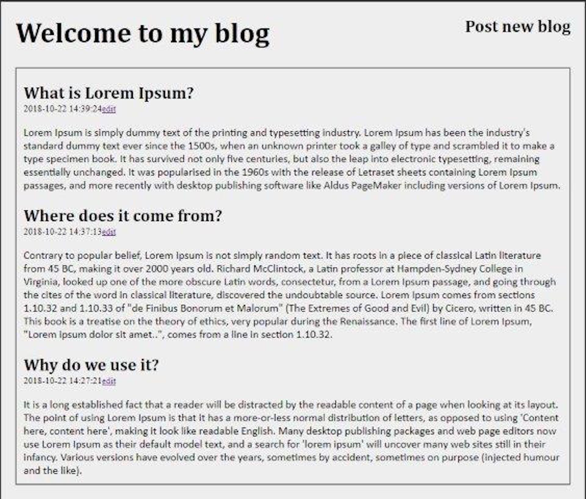

This is my effort to learn web development with python. The project demonstrates the functionalities of python, jinja, sqlLite and Flask framework.

    

### Features:
* Login with user database
* Anyone with an account can see any blog
* Each user may have their own blog
* Users can't edit someone's blog

### References:
 * Source code: [Link](https://github.com/jimmy-vo/BlogsDemo) 

